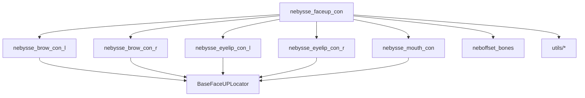
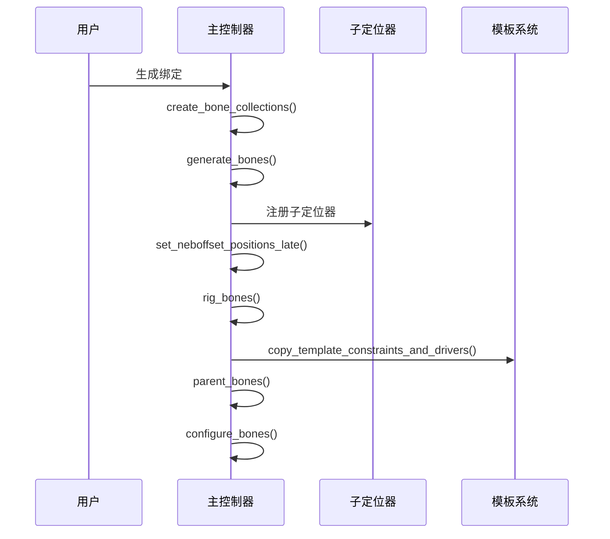
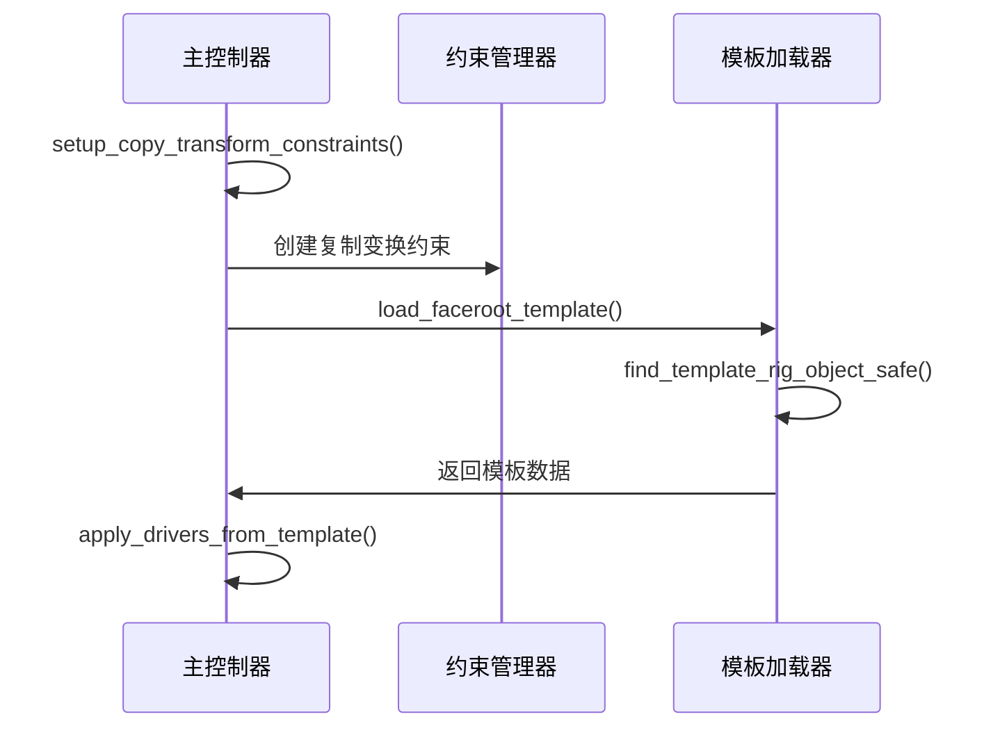

# NebysseFacer API 文档

## 项目概述

**NebysseFacer** 是一个专为Blender 4.1设计的高级面部绑定系统，基于Rigify框架开发。它提供了完整的面部控制解决方案，包括眉毛、眼睑、嘴部等精细控制器，以及智能权重骨骼系统。

### 核心特性

- 🎯 **模块化设计**：独立的面部控制定位器
- ⚖️ **智能权重系统**：NebOffset骨骼自动生成和管理
- 🔧 **自定义坐标支持**：可调整的DISW骨骼位置
- 📋 **模板驱动**：从blend文件自动加载约束和驱动器
- 🎨 **UI集成**：完整的Rigify面板集成
- 🏗️ **骨骼集合管理**：自动分类和组织

---

## 安装和设置

### 系统要求

- **Blender版本**：4.1+
- **Rigify插件**：已启用
- **Python版本**：3.10+

### 安装步骤

1. 将`NebysseFacer`文件夹复制到Blender的rigify rigs目录
2. 重启Blender或重新加载Rigify插件
3. 在Rigify元骨骼属性中选择相应的面部绑定类型

---

## 架构概述

### 目录结构

```
NebysseFacer/
├── rigs/                           # 主要绑定模块
│   ├── nebysse_faceup_con.py      # 主控制器
│   ├── nebysse_brow_con_l.py      # 左眉控制器
│   ├── nebysse_brow_con_r.py      # 右眉控制器
│   ├── nebysse_eyelip_con_l.py    # 左眼睑控制器
│   ├── nebysse_eyelip_con_r.py    # 右眼睑控制器
│   ├── nebysse_mouth_con.py       # 嘴部控制器
│   ├── nebysse_base_faceup_locator.py # 基础定位器类
│   ├── nebysse_collection_utils.py    # 集合管理工具
│   ├── neboffset_bones.py         # NebOffset骨骼配置
│   └── utils/                     # 工具模块
│       ├── blend_template_loader.py
│       ├── bone_detector.py
│       ├── constraint_manager.py
│       ├── generation_manager.py
│       └── template_manager.py
├── templates/                      # 模板文件
│   └── Nebysse_FaceUP_Tem.blend
└── utils/                         # 面部控制工具
    └── face_utils.py
```

### 核心模块关系



---

## 核心API参考

### 1. 主控制器 (nebysse_faceup_con)

#### 类定义
```python
class Rig(BaseRig):
    """FaceUP-con: 面部控制主控系统"""
```

#### 主要方法

##### `generate_bones()`
生成整个面部骨骼结构。

**返回值**: 无

**功能**:
- 创建顶层骨骼结构
- 生成NebOffset权重骨骼
- 设置骨骼集合

##### `rig_bones()`
设置约束系统和骨骼分配。

**功能**:
- 分配骨骼到相应集合
- 设置复制变换约束
- 从模板复制约束和驱动器

##### `parent_bones()`
建立骨骼父子关系。

**层级结构**:
```
Neb_Facer_root
├── Neb_face-root
├── Neb_RigifyFace
│   └── NebOffset-* (所有权重骨骼)
└── brow-root.L/R
    └── eyelip-root.L/R
        └── mouth-root
```

#### 骨骼集合

| 集合名称 | 用途 | UI行 | 颜色ID |
|---------|------|------|--------|
| Neb_Face | 主要面部系统 | 1 | 5 |
| Neb_Con | 主控制器 | 2 | 2 |
| Neb_Disw | 距离权重控制 | 4 | 3 |
| Neb_MCH | 面部机制骨骼 | 3 | 4 |

#### 参数配置

```python
@staticmethod
def add_parameters(params):
    # 约束设置
    params.enable_copy_constraints = BoolProperty(default=True)
    params.constraint_influence = FloatProperty(default=1.0)
    params.constraint_mix_mode = EnumProperty(default='BEFORE')
    
    # 生成模式
    params.generation_mode = EnumProperty(default='AUTO')
    params.manual_bone_list = StringProperty()
```

### 2. 眉毛控制器 (nebysse_brow_con_l/r)

#### 类定义
```python
class Rig(BaseFaceUPLocator, BaseFaceUPCollectionMixin):
    """左/右眉毛控制定位器"""
```

#### 生成的骨骼结构

```
brow-root.L/R (根骨骼)
├── brow-con.L/R (控制器)
├── DISW-brow.T.L/R.001 (上眉内侧)
├── DISW-brow.T.L/R.002 (上眉中部)
├── DISW-brow.T.L/R (上眉外侧)
├── DISW-brow.B.L/R (下眉外侧)
└── DISW-brow.B.L/R.001 (下眉内侧)
```

#### DISW骨骼坐标系统

##### 默认坐标 (左眉)
```python
default_positions = {
    "DISW-brow.T.L.001": Vector((-0.015, 0.005, 0.02)),
    "DISW-brow.T.L.002": Vector((-0.025, 0.005, 0.015)),
    "DISW-brow.T.L": Vector((-0.035, 0.005, 0.01)),
    "DISW-brow.B.L": Vector((-0.03, 0.003, -0.005)),
    "DISW-brow.B.L.001": Vector((-0.02, 0.003, -0.01))
}
```

##### 自定义坐标参数
```python
# 每个DISW骨骼都有独立的X、Y、Z坐标参数
params.disw_t_001_x = FloatProperty(default=-0.015)
params.disw_t_001_y = FloatProperty(default=0.005)
params.disw_t_001_z = FloatProperty(default=0.02)
# ... 其他骨骼的坐标参数
```

#### 主要方法

##### `get_disw_positions_from_params()`
从用户参数读取DISW骨骼坐标。

**返回值**: `Dict[str, Vector]` - 骨骼名称到坐标的映射

##### `generate_bones()`
生成眉毛控制骨骼层级。

**特性**:
- 自动设置相对于控制器的坐标
- 支持自定义位置参数
- 调试信息输出

### 3. 眼睑控制器 (nebysse_eyelip_con_l/r)

#### 类定义
```python
class Rig(BaseFaceUPLocator):
    """左/右眼睑控制定位器"""
```

#### 生成的骨骼
- **单个控制骨骼**: `eyelip-con.L` / `eyelip-con.R`

#### 约束系统

##### 从模板加载约束
```python
def load_constraints_from_template():
    """从Nebysse_FaceUP_Tem.blend加载约束"""
```

支持的约束类型:
- `LIMIT_LOCATION` - 位置限制
- `LIMIT_ROTATION` - 旋转限制  
- `LIMIT_DISTANCE` - 距离限制

##### 约束参数配置
```python
# 位置限制参数
params.limit_location_min_x = FloatProperty(default=-0.1)
params.limit_location_max_x = FloatProperty(default=0.1)

# 旋转限制参数
params.limit_rotation_min_y = FloatProperty(default=-0.5)
params.limit_rotation_max_y = FloatProperty(default=0.5)

# 距离限制参数
params.limit_distance_value = FloatProperty(default=0.1)
```

### 4. 基础定位器类 (BaseFaceUPLocator)

#### 核心功能

##### 父级系统注册
```python
def register_to_faceup_controller(self):
    """注册到主控制器的子级定位器系统"""
```

##### 骨骼配置
```python
def configure_bones(self):
    """配置骨骼属性（锁定、解锁特定轴）"""
```

### 5. NebOffset骨骼配置 (neboffset_bones)

#### 核心配置

##### 骨骼属性列表
```python
NEBOFFSET_BONE_ATTRIBUTES = [
    'brow.T.L.003', 'brow.T.L.002', 'brow.T.L.001',
    'brow.T.R.003', 'brow.T.R.002', 'brow.T.R.001',
    'lip.T.L.001', 'lip.T.L.002', 'lip.B.L.001',
    # ... 更多骨骼属性
]
```

##### 约束映射关系
```python
CONSTRAINT_MAPPINGS = [
    ('brow.T.L.003', 'NebOffset-brow.T.L.003'),
    ('brow.T.L.002', 'NebOffset-brow.T.L.002'),
    # ... rigify骨骼 -> NebOffset骨骼映射
]
```

##### 位置映射关系
```python
POSITION_MAPPINGS = [
    ('brow.T.L.003', 'brow.T.L.003'),
    ('lip.T', 'lip.T.L'),  # 特殊映射关系
    ('lips.L', 'cheek.B.L'),  # 特殊映射关系
    # ... 更多位置映射
]
```

---

## 工具API参考

### 1. 模板管理器 (TemplateManager)

#### 主要方法

##### `load_faceroot_template()`
加载面部根骨骼模板数据。

**返回值**: `Dict` - 模板数据

##### `apply_drivers_from_template(template_data)`
从模板数据应用驱动器。

**参数**:
- `template_data`: 模板数据字典

### 2. 骨骼检测器 (BoneDetector)

#### 静态方法

##### `detect_rigify_head_bone(armature_obj)`
检测rigify头部骨骼。

**参数**:
- `armature_obj`: Blender骨架对象

**返回值**: `str` - 头部骨骼名称

### 3. 约束管理器 (ConstraintManager)

处理约束的复制和配置。

### 4. 生成管理器 (GenerationManager)

管理骨骼生成过程。

---

## 使用示例

### 1. 基本面部绑定设置

```python
# 1. 在Blender中创建元骨骼
# 2. 在Rigify属性中选择 'nebysse_faceup_con'
# 3. 配置参数
params = rig.params
params.enable_copy_constraints = True
params.constraint_influence = 1.0

# 4. 生成绑定
bpy.ops.pose.rigify_generate()
```

### 2. 自定义眉毛DISW骨骼位置

```python
# 设置左眉毛DISW骨骼自定义坐标
brow_params = brow_rig.params
brow_params.use_custom_positions = True

# 调整T.001骨骼位置
brow_params.disw_t_001_x = -0.020  # 向左移动
brow_params.disw_t_001_z = 0.025   # 向上移动

# 重新生成以应用更改
```

### 3. 眼睑约束配置

```python
# 配置眼睑控制约束
eyelid_params = eyelid_rig.params
eyelid_params.load_constraints_from_template = True

# 调整位置限制
eyelid_params.limit_location_min_z = -0.05
eyelid_params.limit_location_max_z = 0.15

# 调整旋转限制
eyelid_params.limit_rotation_min_y = -0.3
eyelid_params.limit_rotation_max_y = 0.3
```

---

## 配置参数详解

### 主控制器参数

#### 约束设置
| 参数名 | 类型 | 默认值 | 描述 |
|--------|------|--------|------|
| `enable_copy_constraints` | bool | True | 启用复制变换约束 |
| `constraint_influence` | float | 1.0 | 约束影响权重 |
| `constraint_mix_mode` | enum | 'BEFORE' | 约束混合模式 |
| `constraint_target_space` | enum | 'LOCAL' | 目标坐标空间 |
| `constraint_owner_space` | enum | 'LOCAL' | 拥有者坐标空间 |

#### 生成模式
| 参数名 | 类型 | 默认值 | 描述 |
|--------|------|--------|------|
| `generation_mode` | enum | 'AUTO' | 骨骼生成模式 |
| `manual_bone_list` | string | "" | 手动骨骼列表 |
| `exclude_bones` | string | "" | 排除骨骼列表 |

### 眉毛控制器参数

#### 基础设置
| 参数名 | 类型 | 默认值 | 描述 |
|--------|------|--------|------|
| `brow_control_size` | float | 0.7 | 控制器大小 |
| `enable_brow_rotation` | bool | False | 启用旋转功能 |
| `enable_disw_bones` | bool | True | 启用DISW骨骼 |
| `use_custom_positions` | bool | True | 使用自定义坐标 |

#### DISW坐标参数
每个DISW骨骼都有独立的X、Y、Z坐标参数：

```python
# DISW-brow.T.L.001 坐标
params.disw_t_001_x = FloatProperty(default=-0.015)
params.disw_t_001_y = FloatProperty(default=0.005)
params.disw_t_001_z = FloatProperty(default=0.02)

# DISW-brow.T.L.002 坐标
params.disw_t_002_x = FloatProperty(default=-0.025)
# ... 其他坐标参数
```

### 眼睑控制器参数

#### 约束设置
| 参数名 | 类型 | 默认值 | 描述 |
|--------|------|--------|------|
| `load_constraints_from_template` | bool | True | 从模板加载约束 |
| `limit_location_min_x` | float | -0.1 | 位置限制最小X |
| `limit_location_max_x` | float | 0.1 | 位置限制最大X |
| `limit_rotation_min_y` | float | -0.5 | 旋转限制最小Y |
| `limit_rotation_max_y` | float | 0.5 | 旋转限制最大Y |

---

## 事件流程

### 1. 骨骼生成流程



### 2. 约束设置流程



---

## 故障排除

### 常见问题

#### 1. NebOffset骨骼父级设置错误

**问题**: NebOffset骨骼的父级是Root而不是Neb_RigifyFace

**解决方案**: 
- 检查`parent_bones()`方法中的父级设置逻辑
- 确保使用CONSTRAINT_MAPPINGS来设置父级关系

#### 2. 自定义坐标不生效

**问题**: 眉毛DISW骨骼位置不正确

**解决方案**:
- 检查`use_custom_positions`参数是否为True
- 验证坐标是否相对于控制器骨骼而不是根骨骼
- 查看控制台调试信息

#### 3. 模板约束加载失败

**问题**: 眼睑控制器约束没有正确加载

**解决方案**:
- 确认模板文件`Nebysse_FaceUP_Tem.blend`存在
- 检查模板文件中是否包含对应的骨骼和约束
- 查看详细的错误日志

### 调试技巧

#### 1. 启用详细日志
系统会自动输出详细的调试信息，包括：
- 参数读取状态
- 骨骼生成进度
- 约束复制结果
- 父级设置统计

#### 2. 验证骨骼结构
```python
# 检查生成的骨骼
for bone in armature.bones:
    if bone.name.startswith("DISW-"):
        print(f"DISW骨骼: {bone.name}, 父级: {bone.parent.name if bone.parent else 'None'}")
```

#### 3. 检查约束设置
```python
# 检查约束
for bone in armature.pose.bones:
    if bone.constraints:
        print(f"骨骼 {bone.name} 约束:")
        for constraint in bone.constraints:
            print(f"  - {constraint.type}: {constraint.name}")
```

---

## 版本信息

- **当前版本**: 1.0.0
- **Blender兼容性**: 4.1+
- **最后更新**: 2024

---

## 贡献指南

### 代码规范

1. **命名约定**
   - 类名：PascalCase
   - 方法名：snake_case
   - 变量名：snake_case
   - 常量：UPPER_CASE

2. **文档字符串**
   ```python
   def method_name(self, param1, param2):
       """方法描述
       
       参数:
           param1: 参数1描述
           param2: 参数2描述
           
       返回值:
           返回值描述
       """
   ```

3. **错误处理**
   - 使用try-except块处理可能的异常
   - 提供有意义的错误信息
   - 包含调试信息

### 测试

1. **单元测试**
   - 每个模块都应有对应的测试
   - 覆盖主要功能路径

2. **集成测试**
   - 测试完整的绑定生成流程
   - 验证各模块间的交互

---

## 许可证

本项目采用 [MIT License](LICENSE)

---

## 联系信息

如有问题或建议，请通过以下方式联系：

- **项目仓库**: [GitHub链接]
- **问题报告**: [Issues链接]
- **文档反馈**: [Documentation Issues链接]

---

*最后更新: 2024年12月* 